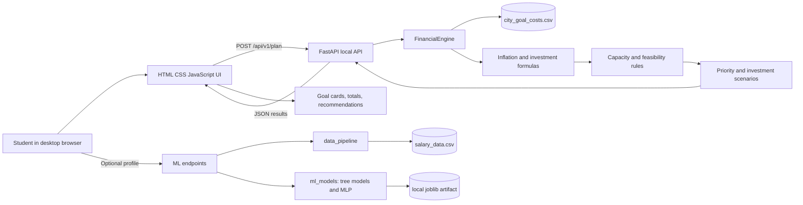

# Architecture and DFD

## Request flow

1. The student fills the local browser form.
2. JavaScript sends the values to the local FastAPI endpoint.
3. `FinancialEngine` loads the selected city's Central-area costs from `city_goal_costs.csv`.
4. The engine calculates future costs, monthly investments, and total feasibility.
5. FastAPI returns deterministic JSON.
6. The browser displays current cost, future cost, monthly investment, capacity, and shortfall/surplus.

## Optional model flow

1. `train_model.py` reads `salary_data.csv`.
2. `data_pipeline/preprocess.py` removes empty or invalid data and excludes `Age` from features.
3. `ml_models/salary_predictor.py` encodes the categories, compares three regressors, and stores the winner locally.
4. `/api/v1/ml/status` reports the model and evaluation metadata.
5. `/api/v1/ml/predict-salary` returns a benchmark from city, education, and job role.
6. The prediction is informational and never replaces the salary used by `/api/v1/plan`.
