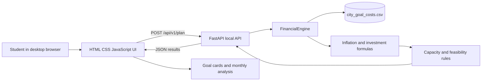

# Architecture and DFD

## Request flow

1. The student fills the local browser form.
2. JavaScript sends the values to the local FastAPI endpoint.
3. `FinancialEngine` loads the selected city's Central-area costs from `city_goal_costs.csv`.
4. The engine calculates future costs, monthly investments, and total feasibility.
5. FastAPI returns deterministic JSON.
6. The browser displays current cost, future cost, monthly investment, capacity, and shortfall/surplus.
